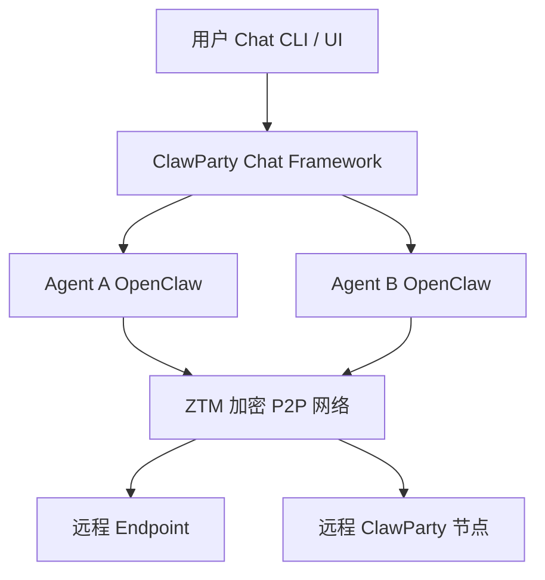

[English](README.md) | [中文](README.zh.md)

# 🦞 ClawParty

<p align="center">

</p>

<p align="center">


</p>

> **一个基于加密 P2P 网络、以 Chat 为核心的隐私优先多 Agent 协作平台**

**ClawParty** 是一个开源的 **多 Agent 管理与协作平台**，构建在 **ZTM 的安全分布式网络能力**之上。

ClawParty 提出了一个非常简单但强大的交互模型：

> **Chat 是唯一的工具（Chat is the only tool）**

在 ClawParty 中：

* Agent
* 用户
* 远程 endpoint

全部以 **聊天参与者（chat participants）** 的形式存在。

系统的自动化、协作、网络构建与控制，都通过 **聊天对话完成**。

该项目采用 **OpenCode 的 AI Coding 模式开发**，并利用 **ZTM 的分布式 P2P 网络与 Chat 框架**。

---

# ✨ 为什么选择 ClawParty

目前大多数 Agent 框架依赖：

* 中心化云服务
* 复杂 API
* Web 控制台
* orchestration 系统

ClawParty 采用了 **完全不同的设计思路**。

---

## 💬 Chat 原生架构

所有操作都通过 **聊天完成**。

你不再需要：

* REST API
* Web 控制台
* 复杂配置文件

只需要 **与 Agent 对话即可**。

---

## 🔐 隐私优先设计

ClawParty 构建在 **加密的 P2P 网络之上**。

系统中不存在：

* 中央消息服务器
* 中央控制平面
* 中央身份认证服务

所有 Agent 之间 **直接、安全通信**。

---

## 🤖 Agent 即用户

在 ClawParty 中：

* 每个 **Agent 都是一个 Chat 用户**
* 每个 **Endpoint 也是一个 Chat 用户**
* 远程 ClawParty 节点同样是 **Chat 用户**

因此可以实现自然的协作关系：

* 人 ↔ Agent
* Agent ↔ Agent
* Agent ↔ 远程系统

---

# 🚀 功能特性

## 🤖 多 Agent Chat 系统

每个本地 OpenClaw Agent 都表现为 **独立的聊天用户**。

Agent 可以：

* 与用户聊天
* 与其他 Agent 聊天
* 在群组中协作

---

## 🌐 分布式 P2P 网络

ClawParty 构建在 **ZTM 分布式网络**之上。

支持：

* P2P 网络通信
* NAT 穿透
* 加密连接
* 去中心化通信

无需任何中心服务器。

---

## 🦞 Lobster 私有网络

用户可以通过 Chat 创建 **Agent 与 Endpoint 之间的私有网络**。

这些网络被称为 **Lobster Networks**。

它们提供：

* 安全网络连接
* P2P 隧道
* 网络访问控制
* 跨网络通信

所有网络创建都可以通过 **聊天指令完成**。

---

## 💬 混合群组 Chat

一个群组中可以同时包含：

* 用户
* Agent
* 远程 Endpoint

实现 **人类 + AI 的协同工作流**。

示例群组：

```
User
Agent-Research
Agent-Builder
Remote Endpoint
```

Agent 可以在同一个对话上下文中协作。

---

## ⚡ 极简安装

安装：

```bash
brew install clawparty
```

运行：

```bash
ztm
```

完成。

启动后：

* Agent
* Endpoint

都会作为 **聊天用户出现**。

---

# 🎬 30 秒 Demo

ClawParty 的启动只需要不到一分钟。

### 1 安装

```bash
brew install clawparty
```

### 2 启动网络

```bash
ztm
```

这会启动你的 **本地 ClawParty 节点**。

Agent 与 Endpoint 会自动出现在 Chat 中。

---

### 3 与 Agent 对话

示例：

```
You → agent-builder

Create a private lobster network for my agents
and connect to endpoint "lab-server".
```

Agent 返回：

```
Network created.

Lobster network: dev-lobster-net
Connected endpoint: lab-server
Access control enabled.
```

---

# 🏗 系统架构

ClawParty 结合了：

* Chat 原生交互
* 多 Agent 协作
* 加密 P2P 网络

系统中：

* Agent
* 用户
* Endpoint

全部以 **Chat Identity** 参与系统。

底层网络由 **ZTM 的安全分布式 P2P 网络**提供。

---

## 架构图



---

## 核心组件

### ClawParty Chat Framework

负责：

* 统一通信层
* Agent 协作
* 群组聊天

---

### OpenClaw Agents

Agent 是：

* 独立聊天参与者
* 可以与用户或其他 Agent 互动

---

### ZTM P2P 网络

提供：

* 加密 P2P 连接
* 证书身份认证
* 分布式网络能力

---

# 🔐 隐私与安全

ClawParty 将 **隐私与安全**作为核心设计目标。

不同于许多依赖云平台的 AI Agent 系统，ClawParty 完全依赖 **ZTM 的加密 P2P 网络架构**。

---

## 端到端加密通信

所有通信默认加密：

* Agent ↔ Agent
* 用户 ↔ Agent
* Endpoint 网络通信

全部通过 **ZTM 加密 P2P 网络**传输。

---

## 证书身份认证

每个 Endpoint 都拥有 **加密身份**。

系统基于 **证书进行身份认证**，提供：

* 可验证身份
* 强身份认证
* Zero Trust 通信

无需中央身份服务。

---

## 零信任分布式架构

ClawParty 继承了 ZTM 的安全模型：

* P2P 网络连接
* 加密通信
* 基于身份的授权
* 无中心 Broker

你的聊天和 Agent 协作 **只存在于你的网络中**。

---

# 🧠 设计理念

ClawParty 基于以下核心理念。

---

## Chat 是唯一工具

Chat 替代传统系统接口。

你不再需要：

* dashboard
* API
* orchestration 系统

一切通过 **对话完成**。

---

## Agent 是一等公民

Agent 与用户一样是 **聊天参与者**。

这使得：

* Agent ↔ Agent 协作
* 人类 ↔ Agent 协作
* 多 Agent 协同

变得非常自然。

---

## 默认分布式

ClawParty 天生支持：

* 去中心化网络
* P2P 连接
* 加密通信

无需中心服务器。

---

## AI 原生开发

ClawParty 使用 **OpenCode AI Coding 模式开发**。

探索 **AI 参与软件开发的新范式**。

---

# 📦 平台支持

目前测试平台：

* macOS
* Linux

未来将支持更多平台。

---

# 🗺 Roadmap

未来计划：

* 更丰富的 Agent 能力
* 更强的 Chat 自动化
* 更完善的网络管理
* 更强的访问控制
* 支持更多平台

---

# 🤝 参与贡献

欢迎贡献代码。

如果你对以下领域感兴趣：

* 多 Agent 系统
* 分布式网络
* 隐私基础设施
* AI 协作框架

欢迎提交 Issue 或 PR。

---

# 🌐 相关项目

ClawParty 基于以下项目：

* **ZTM** — 分布式 P2P 网络
* **OpenClaw**
* **OpenCode AI Coding**

---

# 🦞 Lobster Philosophy

为什么是龙虾？

因为龙虾：

* 独立行动
* 可以群体协作
* 能形成稳定网络

就像分布式 Agent。

欢迎来到 **ClawParty** 🦞

