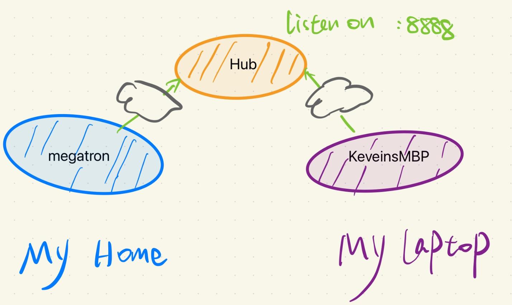
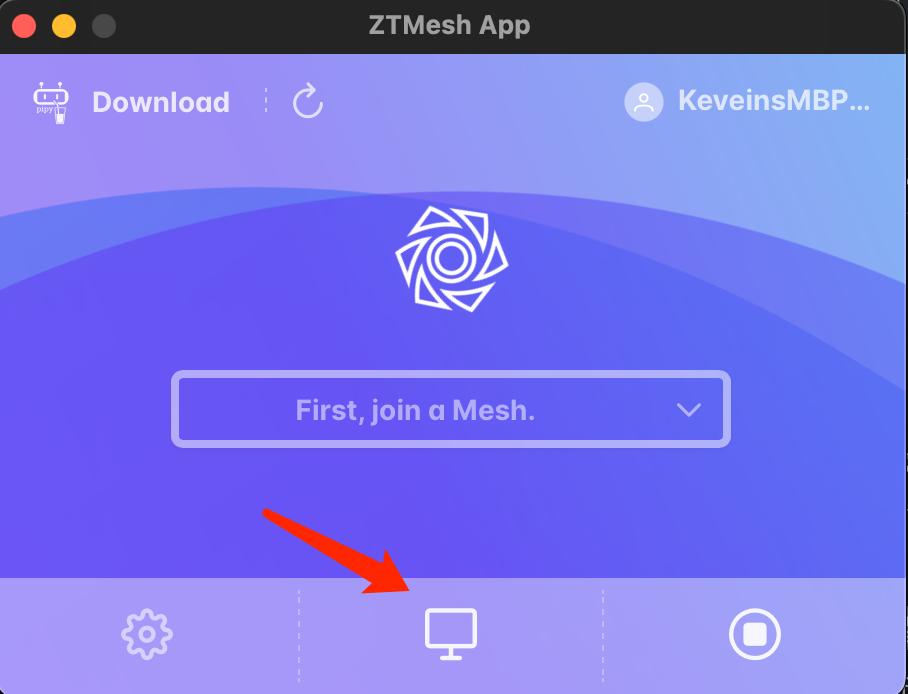
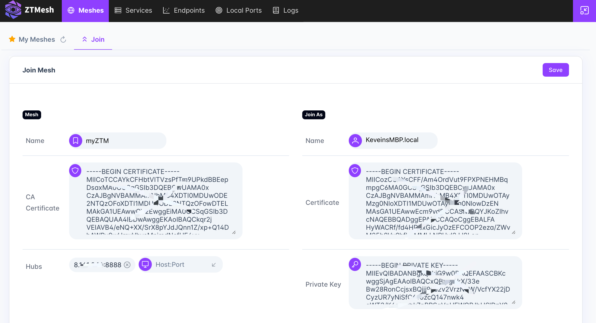
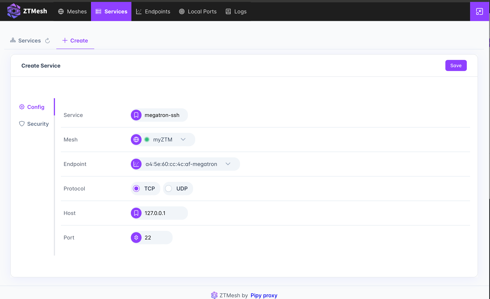
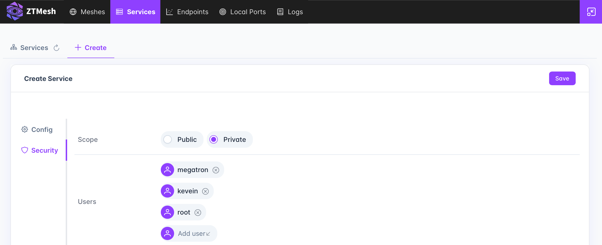
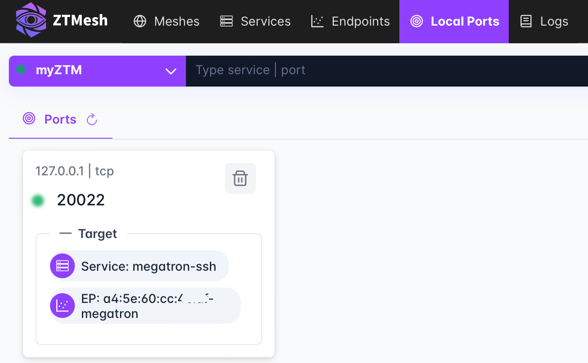
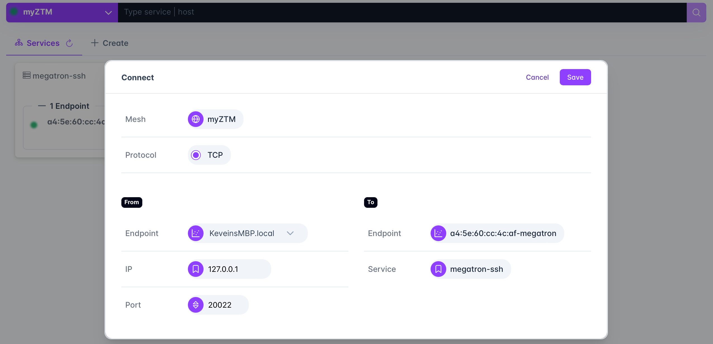
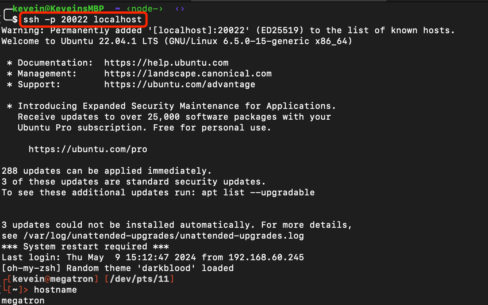

# Quick Start

Here's the step by step quick start docs. Since more features are emerging, please feel free to open an issue if you find mismatch of this doc. Well, let's start!

## Prepare

* Clone this repo.

```shell
$ git clone https://github.com/flomesh-io/ztm.git
```

* Download the latest App that suits your computor/laptop.

```
https://github.com/flomesh-io/ztm/releases
```

* Any release Linux machine from your public cloud vendor, which has an elastic IP. We recommand `Ubuntu 22` 、`Ubuntu 24` 、`Debian12` and `CentOS Stream`. This is the box you shall run `ZTM Hub`.

   **Please pay attention**: you should accept all IPs accessing port `8888`. Refer to your public cloud vendor, like `Security Groups` or `Firewalls`.

## Network topology



In this case, I'm trying access `ssh` service of `megatron` from `KeveinsMBP`.

## Deploy the ZTM Hub

* Login to your Hub box, which is the **public cloud instance**. 

``` shell
$ ssh kevein@myhub
$ arch=`uname -m`
$ wget https://pipy-oss-1255617643.cos-website.ap-beijing.myqcloud.com/repo/pipy/${arch}/binary/pipy-1.1.0-33-generic_linux-${arch}.tar.gz
$ tar xvf pipy-1.1.0-33-generic_linux-${arch}.tar.gz && sudo cp -f usr/local/bin/pipy /usr/local/bin && rm -fr usr
$ git clone https://github.com/flomesh-io/ztm.git
```

* Then start up `CA` Service.

```shell
$ cd ~/ztm/ca
$ screen -S ztm-ca   # you'll enter a screen session
$ ./main.js
./main.js 
2024-05-09 00:55:17.573 [INF] [listener] Listening on TCP port 9999 at 0.0.0.0
2024-05-09 00:55:17.573 [INF] [worker] Thread 0 started


(Use ctrl+a then ctrl+d to detach from this screen session)
```

* Run `Hub` service.

```shell
$ cd ~/ztm/hub
$ screen -S ztm-hub # you'll enter a screen session
$ ./main.js  --name=x.x.x.x:8888
...detail omitted...
-----END CERTIFICATE-----

2024-05-09 01:01:49.827 [INF] [listener] Listening on TCP port 8888 at 0.0.0.0
2024-05-09 01:01:49.827 [INF] Hub started at 0.0.0.0:8888
```

* `x.x.x.x`: The public IP address of the Hub.

>  **_NOTE:_** We'll soon provide systemd scripts for CA and Hub service instead of using screen.

 **Again**, please make sure the port `8888` is public accessable.

## Get certificates for both your agents

Every agent use certifcate to communicate with Hub(s). And `Hub` can abstract user name from certs. At this moment, a super user can manipulate all agents that called `root`.

### Get cert for megatron

* Run the following command on `Hub`:

```shell
$ curl -d '' http://localhost:9999/api/certificates/megatron  | tee megatron.key
$ curl http://localhost:9999/api/certificates/megatron  | tee megatron.pem
$ curl http://localhost:9999/api/certificates/ca | tee ca.pem
```

Download all these there files to the host `megatron`.

### Get cert for KeveinsMBP

* Run the following command on `Hub`:

```shell
$ curl -d '' http://localhost:9999/api/certificates/root  | tee root.key
$ curl http://localhost:9999/api/certificates/root  | tee root.pem
$ curl http://localhost:9999/api/certificates/ca | tee ca.pem
```

Download all these there files to the host `KeveinsMBP`. This is the super user of current mesh.

## Join the Mesh

### With cli 

The OS of  host `megatron` is `ubuntu 22.04`, and I can only login on it with `ssh`. Let's run the `ZTM agent` in command line mode.

```shell
(on host megatron)
$ git clone https://github.com/flomesh-io/ztm.git
$ mkdir ~/.ztm
$ cd ztm/agent
$ screen -S ztm-agent   # you'll enter a screen session
$ ./main.js --database=~/.ztm/ztm.db
2024-05-09 14:22:53.730 [INF] [listener] Listening on TCP port 7777 at 127.0.0.1
2024-05-09 14:22:53.730 [INF] [worker] Thread 0 started

(Use ctrl+a then ctrl+d to detach from this screen session)
```

Then you can register this agent to hub.

```shell
$ curl localhost:7777/api/meshes/myZtm -d '{"agent":{"name":"a4:5e:60:cc:5c:ae-megatron"},"bootstraps":["x.x.x.x:8888"]}'
$ curl localhost:7777/api/meshes/myZtm/agent/key --data-binary @./megatron.key 
$ curl localhost:7777/api/meshes/myZtm/ca --data-binary @./ca.pem 
$ curl localhost:7777/api/meshes/myZtm/agent/certificate --data-binary @./megatron.pem 
```

* `x.x.x.x`: Replace this with IP of your public cloud instance, as know as the `ZTM Hub`.
* `myZtm`: Means your mesh name. It's an arbitrary name as you like. And it doesn't affect any other agents.

### With graphical UI

Download suitable app according to your CPU arch and operating system. In this case, I use `ZTMesh_0.1.0_aarch64.dmg`.

After installing the app, start it. And you'll see like this:



> **_NOTE:_** About macOS "can’t be opened" Error

> ```
> sudo xattr -rd com.apple.quarantine /Applications/ZTMesh.app
> ```

Click `mesh console` (screen icon which is in the bottom-middle) and configure the mesh, then `Save` it.



* `CA certificate`: copy the content of `ca.pem`.
* `Certificate`: certificate of `root` user, aka `root.pem`.
* `Private Key`: private key of `root` user, aka `root.key`.

> **_NOTE_**: When input Hubs address, you should press Enter key.

## Expose your first service

In this case, I'd like to access `megatron` from SSH.



* `Service`: Arbitrary name that you can know what service it is.
* `Mesh`: Which mesh you want to expose this service to. (Since we can join multiple meshes)
* `Endpoint`: Which endpoint(aka: agent) the service is on.
* `Protocol`: The service protocol.
* `Host`: The address of this service.
* `Port`: The port of this service.

> **_NOTE_**: if you want access another machine from the agent, just make sure the agent can reach out to that machine.



* `Scope`: Is this service public available or just for specific users.
* `Users`: Only appears in `Private` mode. User name is the name you signed from CA server.

Now you can save this service.

## Create local port for accessing

Now you need create a local port to access `megatron-ssh` service.



Click the `circle`:



* `From`
  * `Endpoint`: Where you access `megatron-ssh` service from
  * `IP`: Usually `127.0.0.1`, means which IP address the local port is listening on.
  * `Port`: Local port you want to connect to service `megatron-ssh`. 
* `To`
  * `Endpoint`: Agent name. Don't need change.
  * `Service`: Service name. Don't need change either.

## Access the remote service

In `Local Ports` tab, you'll see the following port:


Let's `ssh` megatron through local port:



**Well done! Now you can access your home computor from anywhere the world!**
