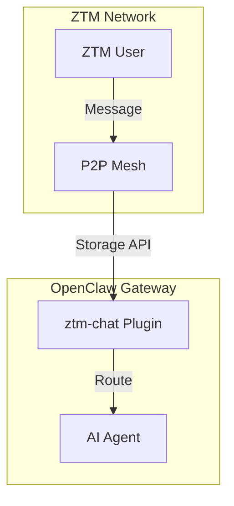
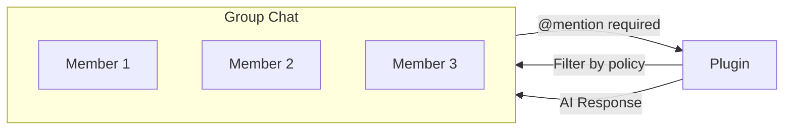
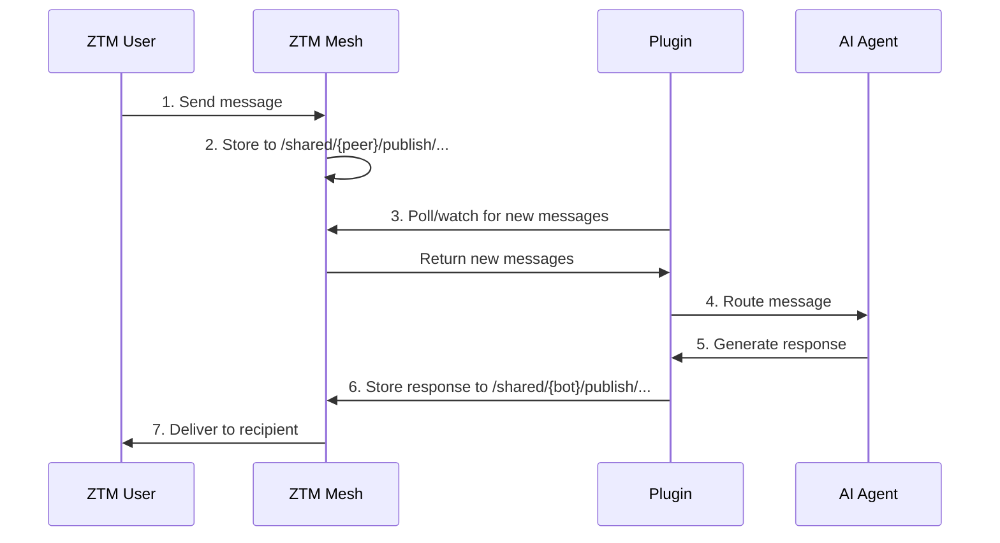
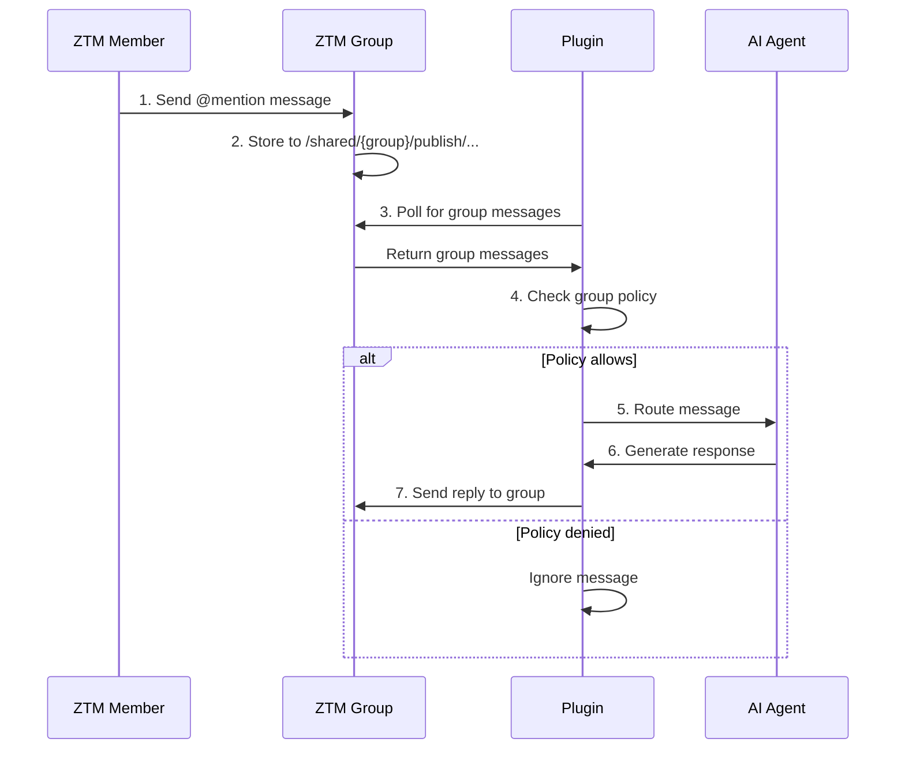

# ZTM Chat Channel Plugin for OpenClaw

This plugin integrates OpenClaw with ZTM (Zero Trust Mesh) Chat, enabling decentralized P2P messaging through the ZTM network.

## Architecture



### Direct Storage Access

This plugin uses **direct ZTM Mesh storage access** for messaging:

| Feature | Implementation |
|---------|---------------|
| Send Messages | `POST /api/setFileData/shared/{bot}/publish/peers/{peer}/messages/{id}` |
| Receive Messages | `GET /api/allFiles/shared/{peer}/publish/peers/{bot}/messages/` |
| User Discovery | `GET /api/allFiles/shared/*/publish/` |
| Real-Time Updates | Polling with configurable interval |

This approach provides full functionality via storage APIs, suitable for headless Gateway deployments.

## Features

- **Peer-to-Peer Messaging**: Send and receive messages with other ZTM users
- **Remote Connection**: Connect to ZTM Agent from anywhere via HTTP API
- **Secure**: Supports mTLS authentication with ZTM certificates
- **Decentralized**: Messages flow through the ZTM P2P network
- **Multi-Account**: Support for multiple ZTM bot accounts with isolated state
- **User Discovery**: Browse and discover other users in your ZTM mesh
- **Real-Time Updates**: Watch mechanism with polling fallback
- **Message Deduplication**: Prevents duplicate message processing
- **Structured Logging**: Context-aware logger with sensitive data filtering
- **Interactive Wizard**: CLI-guided configuration setup
- **Group Chat Support**: Multi-user group conversations with permission control
- **Fine-Grained Access Control**: Per-group policies, mention gating, and tool restrictions

## Installation

### 1. Install ZTM CLI

Download ZTM from GitHub releases and install to `/usr/local/bin`:

```bash
# Download (example: v1.0.4 for Linux x86_64)
curl -L "https://github.com/flomesh-io/ztm/releases/download/v1.0.4/ztm-aio-v1.0.4-generic_linux-x86_64.tar.gz" -o /tmp/ztm.tar.gz

# Extract
tar -xzf /tmp/ztm.tar.gz -C /tmp

# Install to /usr/local/bin (requires sudo)
sudo mv /tmp/bin/ztm /usr/local/bin/ztm

# Cleanup
rm /tmp/ztm.tar.gz

# Verify
ztm version
```

### 2. Start ZTM Agent

```bash
ztm start agent
```

The agent will start listening on `http://localhost:7777` by default.

### 3. Install Plugin

```bash
openclaw plugins install -l ./extensions/ztm-chat

# Or install from npm (when published)
# npm install -g @ztm/openclaw-ztm-chat
# openclaw plugins install @ztm/openclaw-ztm-chat
```

### 4. Run Configuration Wizard

```bash
openclaw ztm-chat-wizard
```

The wizard will guide you through:
1. ZTM Agent URL (default: `http://localhost:7777`)
2. Permit Server URL (default: `https://ztm-portal.flomesh.io:7779/permit`)
3. Bot Username (default: `openclaw-bot`)
4. Security Settings (DM policy, allowFrom list)
5. Summary & Save

### 5. Restart OpenClaw

```bash
openclaw gateway restart
```

## Group Chat

### Overview

ZTM Chat supports group conversations with fine-grained permission control. When `enableGroups` is enabled, the bot can:

- Receive and process messages from group chats
- Reply to group messages with @mention support
- Apply per-group access policies
- Restrict available tools based on group membership

### How It Works



### Enabling Group Chat

```bash
# Enable via wizard
openclaw ztm-chat-wizard
# Select "Enable Groups" when prompted

# Or manually in openclaw.yaml
```

### Group Policy Modes

| Policy | Behavior |
|--------|----------|
| `open` | Allow all group messages (with optional mention requirement) |
| `allowlist` | Only allow whitelisted senders |
| `disabled` | Block all group messages |

### Mention Gating

When `requireMention` is enabled, the bot will only process messages that @mention the bot username:

```
# Bot username: my-bot

# These messages will be processed:
@my-bot can you help me?
Hey @my-bot what's up?

# These messages will be ignored:
hello everyone!
good morning
```

### Per-Group Configuration

You can configure different policies for different groups:

```yaml
channels:
  ztm-chat:
    accounts:
      my-bot:
        enableGroups: true
        groupPolicy: allowlist  # Default for unknown groups
        groupPermissions:
          alice/team:
            groupPolicy: open
            requireMention: false
          bob/project-x:
            groupPolicy: allowlist
            requireMention: true
            allowFrom: [bob, charlie, david]
          private/secret-group:
            groupPolicy: disabled
```

### Tool Restrictions

Control which tools are available in each group:

```yaml
channels:
  ztm-chat:
    accounts:
      my-bot:
        groupPermissions:
          alice/team:
            groupPolicy: open
            requireMention: false
            tools:
              allow:
                - group:messaging
                - group:sessions
                - group:runtime
            toolsBySender:
              admin:
                alsoAllow:
                  - exec
                  - fs
```

#### Tool Policy Options

| Option | Description |
|--------|-------------|
| `tools.allow` | Only allow these tools (deny all others) |
| `tools.deny` | Deny these tools (allow all others) |
| `toolsBySender.{user}.alsoAllow` | Additional tools for specific users |
| `toolsBySender.{user}.deny` | Deny tools for specific users |

#### Default Tools

By default, groups only have access to:
- `group:messaging` - Send/receive messages
- `group:sessions` - Session management

### Creator Privileges

Group creators always have full access regardless of policy settings. This ensures the bot owner can always interact with their own groups.

## Usage

### Sending a Message

From any ZTM user, send a message to your bot:

```
Hello! Can you help me with something?
```

The bot will respond through OpenClaw's AI agent.

### Pairing Mode

By default, the bot uses **pairing mode** (`dmPolicy: "pairing"`):

1. **New users** must be approved before they can send messages
2. When an unapproved user sends a message, the bot sends them a pairing code
3. Approve users using the CLI with their pairing code

#### List Pending Requests

```bash
openclaw pairing list ztm-chat
```

#### Approve a Pairing Request

```bash
openclaw pairing approve ztm-chat <code>
```

#### Pairing Mode Policies

| Policy | Behavior |
|--------|----------|
| `allow` | Accept messages from all users (no approval needed) |
| `deny` | Reject messages from all users (except allowFrom list) |
| `pairing` | Require explicit approval for new users (recommended) |

## CLI Commands

### Plugin Commands

```bash
# Setup wizard
openclaw ztm-chat-wizard

# Auto-discover existing configuration
openclaw ztm-chat-discover
```

### Channel Commands

```bash
# Check channel status
openclaw channels status ztm-chat

# View configuration
openclaw channels describe ztm-chat

# Probe connection
openclaw channels status ztm-chat --probe

# Enable/disable channel
openclaw channels disable ztm-chat
openclaw channels enable ztm-chat

# List connected peers
openclaw channels directory ztm-chat peers

# List groups (if enabled)
openclaw channels directory ztm-chat groups
```

### Pairing Commands

```bash
# List pending pairing requests
openclaw pairing list ztm-chat

# Approve a pairing request
openclaw pairing approve ztm-chat <code>
```

## Configuration

### Configuration File

Configuration is stored in `openclaw.yaml` under `channels.ztm-chat`:

```yaml
channels:
  ztm-chat:
    enabled: true
    accounts:
      my-bot:
        agentUrl: "http://localhost:7777"
        permitUrl: "https://ztm-portal.flomesh.io:7779/permit"
        meshName: "production-mesh"
        username: "my-bot"
        enableGroups: true
        autoReply: true
        messagePath: "/shared"
        dmPolicy: "pairing"
        allowFrom:
          - alice
          - trusted-team
        groupPolicy: "allowlist"
        groupPermissions:
          alice/team:
            creator: "alice"
            group: "team"
            groupPolicy: "open"
            requireMention: false
            allowFrom: []
            tools:
              allow:
                - group:messaging
                - group:sessions
                - group:runtime
            toolsBySender:
              admin:
                alsoAllow:
                  - exec
```

### Configuration Options

**Required:**

| Option | Type | Description |
|--------|------|-------------|
| `agentUrl` | string | ZTM Agent API URL |
| `permitUrl` | string | Permit Server URL |
| `meshName` | string | Name of your ZTM mesh |
| `username` | string | Bot's ZTM username |

**Optional - Basic:**

| Option | Type | Default | Description |
|--------|------|---------|-------------|
| `enabled` | boolean | `true` | Enable/disable account |
| `enableGroups` | boolean | `false` | Enable group chat support |
| `autoReply` | boolean | `true` | Automatically reply to messages |
| `messagePath` | string | `/shared` | Custom message path prefix |
| `dmPolicy` | string | `"pairing"` | DM policy: `allow`, `deny`, `pairing` |
| `allowFrom` | string[] | `[]` | List of approved usernames |

**Optional - Group:**

| Option | Type | Default | Description |
|--------|------|---------|-------------|
| `groupPolicy` | string | `"allowlist"` | Default group policy: `open`, `allowlist`, `disabled` |
| `groupPermissions` | object | `{}` | Per-group permission overrides |

### Group Permission Options

| Option | Type | Description |
|--------|------|-------------|
| `groupPolicy` | string | Policy for this group: `open`, `allowlist`, `disabled` |
| `requireMention` | boolean | Require @mention to process message (default: `true`) |
| `allowFrom` | string[] | Whitelist of allowed senders |
| `tools.allow` | string[] | Only allow these tools |
| `tools.deny` | string[] | Deny these tools |
| `toolsBySender` | object | Sender-specific tool overrides |

### Environment Variables

| Variable | Description |
|----------|-------------|
| `ZTM_CHAT_LOG_LEVEL` | Logging level: `debug`, `info`, `warn`, `error` |

## Message Flow



### Group Message Flow



## ZTM Agent API

### Storage API

| Method | Path | Description |
|--------|------|-------------|
| GET | `/api/meshes/{meshName}` | Get mesh connection status |
| GET | `/api/allFiles{path}` | List files in a directory |
| POST | `/api/setFileData{path}` | Write data to a file |
| GET | `/api/getFileData{path}` | Read file contents |
| GET | `/api/watch{prefix}` | Watch for path changes |

### Message Paths

| Direction | Path Pattern | Description |
|-----------|-------------|-------------|
| Send | `/shared/{bot}/publish/peers/{peer}/messages/{time}-{sender}.json` | Bot publishes to peer |
| Receive | `/shared/{peer}/publish/peers/{bot}/messages/*.json` | Peers publish to bot |
| Discovery | `/shared/*/publish/` | Scan for active users |

## Troubleshooting

### Connection Failed

1. Verify ZTM Agent is running:
   ```bash
   curl http://localhost:7777/api/meshes
   ```

2. Check mesh name matches:
   ```bash
   ztm get mesh
   ```

3. Check plugin logs:
   ```bash
   openclaw logs --level debug --channel ztm-chat
   ```

### No Messages Received

1. Check bot username is correct in configuration
2. Verify ZTM Agent is running:
   ```bash
   curl http://localhost:7777/api/meshes
   ```
3. Check mesh connectivity:
   ```bash
   openclaw channels status ztm-chat --probe
   ```

## Development

### Running Tests

```bash
cd extensions/ztm-chat
npm install
npm test          # Run all tests
npm test:watch    # Watch mode
```

### Test Coverage

```
Test Files  7 passed (7)
      Tests  192 passed (192)

Coverage:
- ZTM API Client: 40 tests
- Configuration: 57 tests
- Channel Plugin: 23 tests
- Wizard: 25 tests
- Logger: 15 tests
- Runtime: 17 tests
- Index: 15 tests
```

### Debug Logging

```bash
ZTM_CHAT_LOG_LEVEL=debug openclaw restart
```

## Project Structure

```
ztm-chat/
├── index.ts              # Plugin entry point
├── index.test.ts         # Plugin tests
├── package.json          # NPM package config
├── openclaw.plugin.json  # OpenClaw plugin manifest
└── src/
    ├── channel.ts        # Channel adapter
    ├── config.ts         # Config schema (TypeBox)
    ├── ztm-api.ts        # API client
    ├── logger.ts         # Structured logging
    ├── runtime.ts        # Runtime management
    ├── wizard.ts         # Setup wizard
    └── mocks/
        └── ztm-client.ts # Mock agent
```
